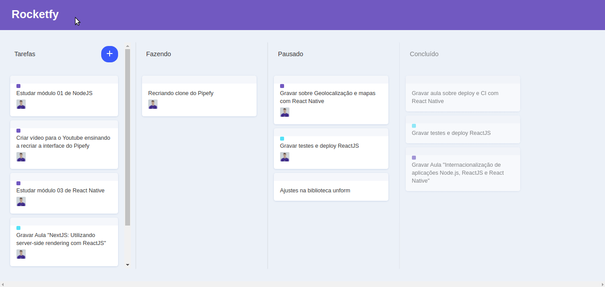

# Rocketfy
Este é um projeto com a finalidade de recriar a interface do PIPEFY usando **React**, com foco especial no recurso de **drag and drop**. O projeto foi realizado junto ao [vídeo](https://youtu.be/awRtgpRsdTQ) da RocketSeat e possui algumas modificações para solução de melhorias, tal como mover um item para uma lista vazia e para outra lista, com itens, sem precisar passar o item sobre outro item.

## Layout
     

## Tecnologias
* React
* Immer
* React DnD
* React Icons
* Styled Components

## Linguagens
* JavaScript
* HTML

## Executar
**Para executar este projeto na sua máquina, execute os seguintes comandos no seu terminal:**
```
$ git clone https://github.com/dhayananascimento/rocketfy.git
$ cd rocketfy
$ yarn install
$ yarn start
```
